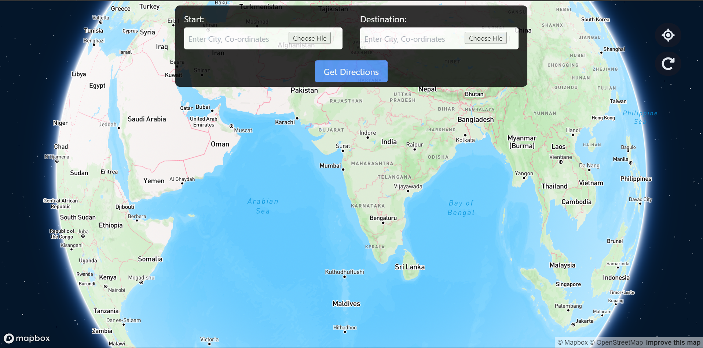
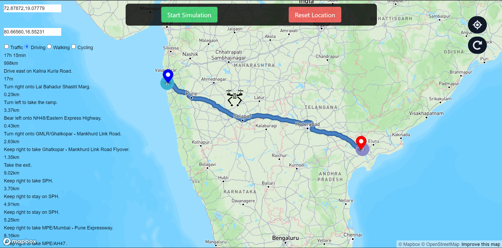

# Drone Simulator

Welcome to the **Drone Simulator**! This application allows users to simulate drone movement on a Mapbox map based on user-provided latitude and longitude coordinates.

## Key Features

- **Interactive World Map**: A dynamic world map is displayed using Mapbox as the app's background, leveraging a variety of npm packages to enhance performance.
  
- **Precise Coordinate Input**: The app accepts a single set of latitude and longitude at a time, ensuring accurate simulation of drone motion.

- **Drone Motion Simulation**: Upon clicking the **Simulate** button, a drone marker is rendered on the map, moving seamlessly along the user-defined path.
  
- **Modern Stack**: The app is built using **React** for the user interface and **Tailwind CSS** for modern, responsive styling.

## Self-Evaluation

I have made every effort to deliver this project in line with the specified requirements. During the development process, I acquired a wide range of new skills and learned about several new technologies, many of which were initially unfamiliar to me. I made sure to thoroughly understand each aspect before implementing it.

While I acknowledge there are areas that could be further refined, I am confident that with the right guidance, I can achieve much more beyond the scope of this project.

---

Thank you for exploring the **Drone Simulator**! I greatly value any feedback and look forward to learning and improving further.
